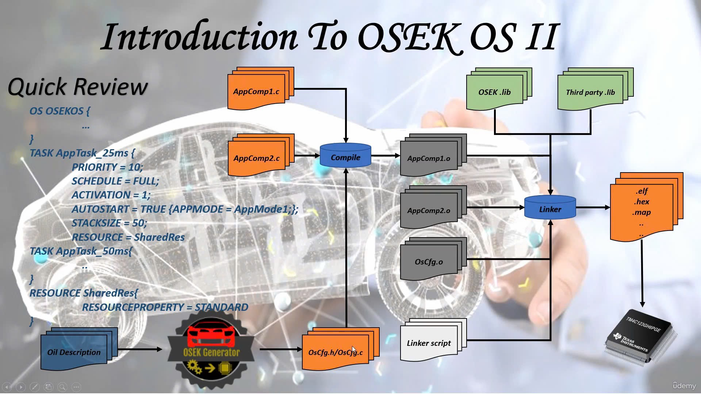

OSEK is a way to manage tasks in a car's computer system (like in AUTOSAR). It helps organize how different parts of the system work together, especially when many tasks need to share the computer's brain (CPU).

Here's how it works:

1. **Two main types of work**:
   - **Interrupt Service Routines (ISRs)**: These are special tasks that respond quickly to things like pressing a button or getting data from a sensor. They need to happen right away.
   - **Tasks**: These are regular jobs the system does, like turning on a light or checking a temperature. Some tasks are simple and others can be paused and resumed.

2. **Three levels of work**:
   - **Interrupt level**: This is where the most important work happens first, like responding to urgent events.
   - **Logical level**: This decides which task should run next, based on priority.
   - **Task level**: This is where tasks are actually carried out by the system.

So, OSEK helps the system handle both urgent tasks and regular ones, making sure everything happens at the right time.

