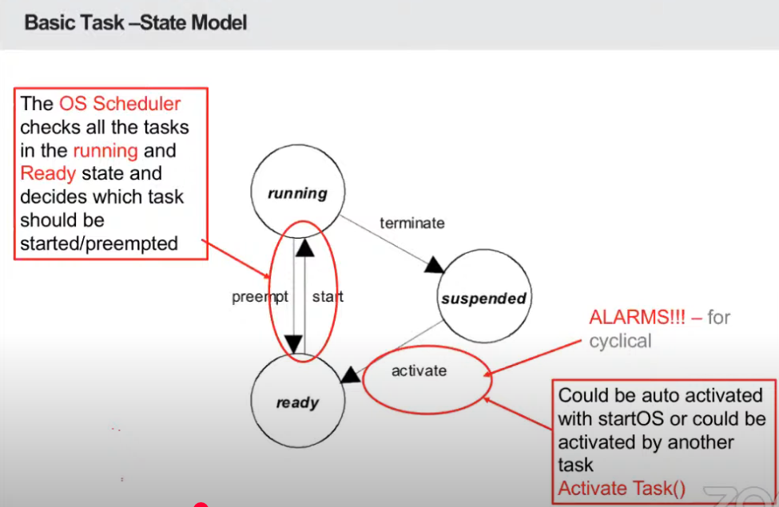
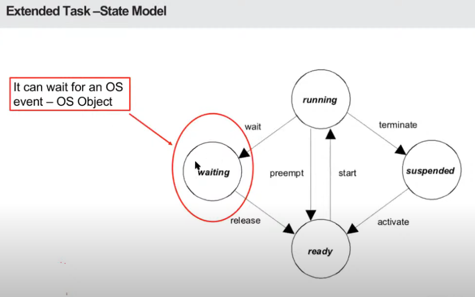

In OSEK, tasks are divided into two types: **Basic Tasks** and **Extended Tasks**. Each type of task is used based on its needs in the system:

1. **Basic Tasks**:
   - **Can be terminated**: These tasks can be stopped before they finish if necessary.
   - **Can be pre-empted**: The OS can interrupt them to run higher-priority tasks.
   - **Can be interrupted**: These tasks can be paused by other events like interrupts.

2. **Extended Tasks**:
   - **Can be in a waiting state**: These tasks might wait for something to happen (like waiting for data).
   - **More complex to manage**: Extended tasks are harder for the OS to handle and use more resources, but they are needed for more complex operations.

In short, **Basic Tasks** are simpler and can be interrupted or stopped easily, while **Extended Tasks** are more complicated and can wait for certain conditions before running.

---

The image shows the **Basic Task State Model** for how tasks work in an OSEK-based system. Here's an easy explanation:

1. **States of a Basic Task**:
   - **Running**: The task is currently executing.
   - **Ready**: The task is ready to run, but the OS scheduler decides when it should start based on priority and availability.
   - **Suspended**: The task is paused temporarily, either by the system or by a higher-priority task.
   
2. **State Transitions**:
   - **Start**: A task can move from the **Ready** state to **Running** when the OS scheduler decides it's its turn to run.
   - **Terminate**: A task can be stopped and moved to the **Suspended** state, meaning it’s no longer running.
   - **Preempt**: If a higher-priority task becomes ready, the **Running** task can be paused (preempted) and moved to **Ready** state.
   - **Activate**: A task can be activated (moved to **Ready** state) either automatically with a system start command (**startOS**) or by another task using **Activate Task()**. 

3. **Alarms**: The image mentions alarms for tasks that need to be run repeatedly or on a schedule, like cyclical tasks.

In short, the task moves between these states based on the scheduler’s decisions and the task's needs. It can be activated, paused, or terminated depending on how it interacts with other tasks or system events.

---

This image shows the **Extended Task State Model** in OSEK. It’s similar to the Basic Task model but includes an additional state where a task can wait for an event.

Here’s an easy explanation:

1. **States of an Extended Task**:
   - **Running**: The task is executing and using CPU time.
   - **Ready**: The task is ready to run, waiting for the scheduler to decide when it should execute.
   - **Suspended**: The task is paused, and it won’t run until it is activated again.
   - **Waiting**: This is the key difference in the Extended Task model. A task can enter the **Waiting** state when it needs to wait for an **OS event**, like waiting for data or a specific condition to be met. This event is typically represented by an **OS Object**. Once the event happens, the task can be released and move back to the **Ready** state.
   
2. **State Transitions**:
   - **Wait**: The task can go to the **Waiting** state if it is waiting for something to happen (an OS event).
   - **Release**: When the event happens, the task is moved back to **Ready** and can be executed.
   - **Preempt**: Like basic tasks, extended tasks can be preempted by higher-priority tasks.
   - **Terminate**: The task can be terminated and moved to **Suspended**.
   - **Activate**: The task can be activated from **Suspended** or **Waiting** state by another task or an OS event.

In short, **Extended Tasks** are more complex than **Basic Tasks** because they can wait for events, making them more suitable for tasks that need to synchronize with other parts of the system or wait for resources.

Here's a simple flow explanation for **Extended Tasks** and when they join the different states in OSEK:

1. **Ready State**:
   - The task is **ready** to run but hasn't started yet.
   - It **joins** this state when the task is created or activated, and it is waiting for the **OS Scheduler** to decide when it should run.
   
2. **Running State**:
   - The task is **currently running** and using CPU time.
   - The task **joins** this state when the OS Scheduler picks it from the **Ready** state.
   - It stays in this state until:
     - It finishes its work and **terminates** (goes to **Suspended**).
     - A higher-priority task preempts it (moves to **Ready**).
     - It needs to **wait for an event** and goes to the **Waiting** state.

3. **Waiting State**:
   - The task needs to **wait for an event** (like waiting for data or a specific condition to be met).
   - The task **joins** this state when it needs to wait for something to happen, such as:
     - Waiting for a specific **OS event** like a resource or data.
     - The event could be triggered by an **interrupt** (e.g., a sensor update) or some other system condition.
   - The task stays in this state until the event occurs and then it is **released** back into the **Ready** state.

4. **Suspended State**:
   - The task is **paused** and cannot run until activated again.
   - The task **joins** this state if:
     - It is **terminated** after finishing its work.
     - The OS explicitly **suspends** it (for example, to save resources).
   - It stays in this state until it's activated again (either by the OS or another task), moving to **Ready**.

### Flow in Simple Steps:
- A task is **Created** → It **joins Ready**.
- The **Scheduler** picks it → It **moves to Running**.
- If it finishes or needs to wait → It **moves to Suspended** or **Waiting**.
- If it waits for something (event) → It stays in **Waiting** until the event happens.
- When the event happens (e.g., interrupt or resource availability) → It **moves back to Ready** to run again.

In short, tasks move between these states depending on whether they need to wait for events, whether they finish their work, or if they are preempted by other tasks.