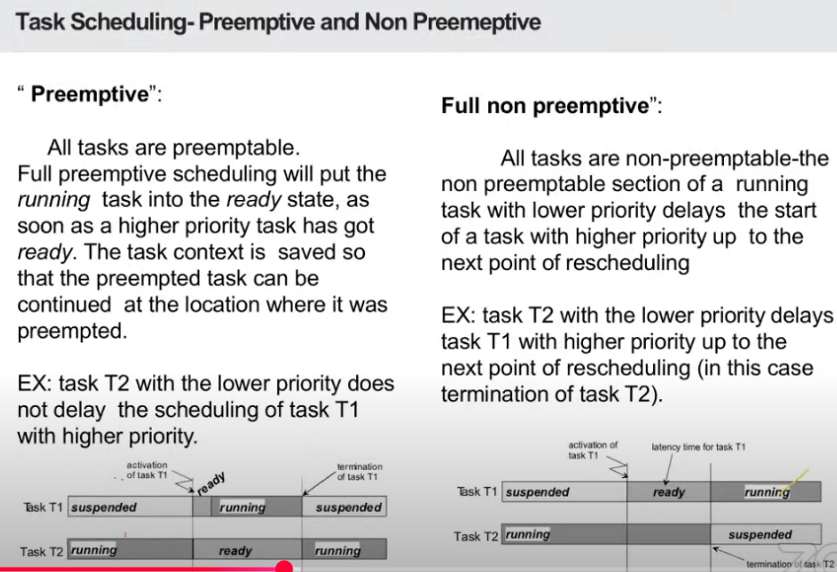

This image explains the two main types of task scheduling: **Preemptive** and **Non-Preemptive** scheduling.

### **Preemptive Scheduling**:
- **What happens**: In **preemptive scheduling**, if a higher-priority task becomes ready while a lower-priority task is running, the OS will stop the lower-priority task and put it into the **Ready state**. This allows the higher-priority task to run immediately.
- **Task context saving**: The OS saves the state of the preempted task so that it can resume exactly where it left off once the higher-priority task finishes.
- **Example**: If **Task T1** has a higher priority than **Task T2**, and both are ready, the OS will preempt **Task T2** and start **Task T1** without delay.
  
**Flow**:
- **Task T2** (lower priority) is running, but **Task T1** (higher priority) becomes ready.
- The OS stops **Task T2** (puts it into **Ready**) and starts **Task T1**.

### **Non-Preemptive Scheduling**:
- **What happens**: In **non-preemptive scheduling**, once a task starts running, it will finish its execution before the OS can start any other task, even if a higher-priority task becomes ready. The lower-priority task delays the higher-priority task until it finishes.
- **Task scheduling delay**: The **higher-priority task** has to wait until the lower-priority task completes its execution, or reaches a "next point of rescheduling" (like the task’s termination).
  
**Example**: If **Task T1** (higher priority) is ready, but **Task T2** (lower priority) is already running, **Task T1** will be delayed until **Task T2** finishes. This can lead to a delay, even though **Task T1** has higher priority.

**Flow**:
- **Task T2** (lower priority) is running, and **Task T1** (higher priority) becomes ready.
- **Task T1** is delayed until **Task T2** finishes its execution.

### Key Difference:
- **Preemptive scheduling** lets higher-priority tasks run immediately, interrupting lower-priority tasks.
- **Non-preemptive scheduling** makes higher-priority tasks wait until lower-priority tasks finish, causing a delay.

In summary:
- **Preemptive** = Higher-priority tasks run immediately and can stop lower-priority tasks.
- **Non-preemptive** = Lower-priority tasks run to completion before higher-priority tasks can execute.