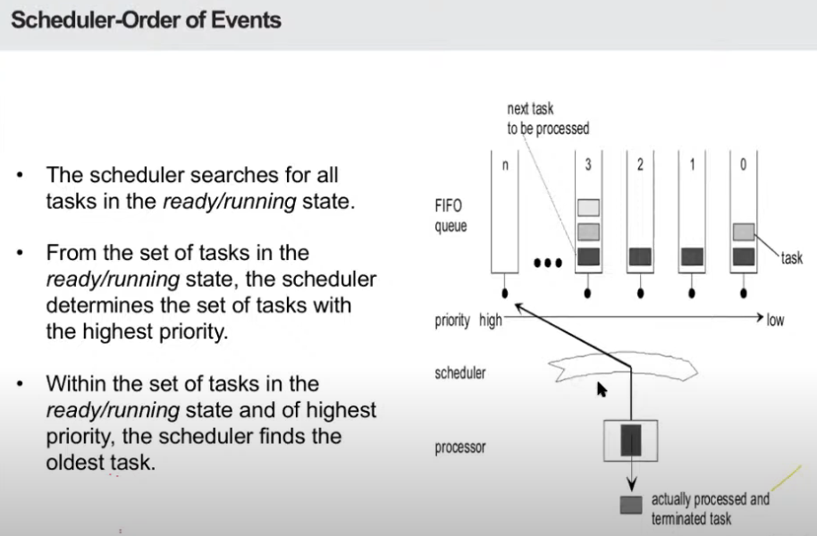

This image shows how the **scheduler** in an OSEK-based system selects and processes tasks. Here's a simple explanation of the process:

### Scheduler Order of Events:

1. **Search for Ready/Running Tasks**:
   - The **scheduler** first looks for tasks that are either in the **Ready** or **Running** state.
   - These tasks are the ones that are ready to be executed or currently executing.

2. **Determine Highest Priority Tasks**:
   - Once the scheduler has found all the **Ready/Running** tasks, it then identifies which tasks have the **highest priority**.
   - **High-priority tasks** are given preference over lower-priority tasks.

3. **Find the Oldest Task**:
   - Among the **high-priority tasks**, the scheduler will choose the **oldest task** to run next.
   - This means that if there are multiple tasks with the same priority, the scheduler picks the one that has been in the **Ready** state the longest.

4. **FIFO Queue for Task Execution**:
   - The tasks are managed in a **FIFO (First In, First Out) queue**, where tasks are placed in line based on when they become ready to run.
   - Once the scheduler has selected the highest-priority, oldest task, it is sent to the **processor** for execution.

5. **Task Processing and Termination**:
   - After the task is processed by the **processor**, it is **terminated** (or completed), and the scheduler looks for the next task to process.

### Summary:
- The scheduler first finds the **Ready** and **Running** tasks.
- It selects the **highest priority** tasks, and if there are multiple, it picks the **oldest** one.
- The chosen task is then sent to the **processor** for execution, and the process repeats for the next task.

---

### **Scheduling Policies in OSEK - Simple Explanation**  

In an **OSEK system**, scheduling means deciding **which task runs next** on the CPU. There are **three types of scheduling** in OSEK:  

### **1. Full Preemptive Scheduling**  
- Tasks can be **interrupted at any time** by a higher-priority task.  
- When does the system switch tasks?  
  - **Task finishes** → The OS picks the next highest-priority task.  
  - **Task chaining** (one task starts another) → The old task stops, and the new one runs.  
  - **Higher priority task is activated** → The OS pauses the current task and runs the higher-priority one.  
  - **A task waits for something** → The OS picks another task to run.  
  - **An event is set for a waiting task** → The waiting task becomes ready and may run.  
  - **A resource is released** → This might allow a higher-priority task to take over.  

### **2. Non-Preemptive Scheduling**  
- A running task **cannot be interrupted** until it finishes or gives up the CPU.  
- When does the system switch tasks?  
  - **Task finishes or starts another task** → The OS picks the next task.  
  - **A task explicitly calls `schedule()`** → The OS chooses a new task to run.  
  - **A task waits for something** → The OS picks another task.  

### **3. Mixed Preemptive Scheduling**  
- Some tasks **can be interrupted**, and others **cannot**.  
- If the running task is **preemptive**, it follows **full preemptive scheduling** rules.  
- If the running task is **non-preemptive**, it follows **non-preemptive scheduling** rules.  

This approach **balances flexibility and control**, ensuring critical tasks are not interrupted unnecessarily while keeping the system responsive.