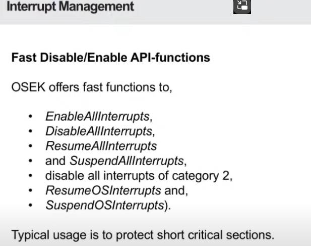

### What is an Interrupt?

- **Interrupts** are like urgent messages that tell the system, "Hey, something important just happened!" For example, when a sensor detects something, it might send an interrupt to the system to handle that event right away.

### **ISR (Interrupt Service Routine)**

- When an interrupt happens, the system needs to run special code to handle it. This special code is called an **ISR** (Interrupt Service Routine).

### Two Types of ISRs:

1. **Category 1 ISR**:
   - **No interaction with the OS**: The ISR doesn’t need the operating system to help. It just does the job, like checking the sensor and returning quickly.
   - **Very fast**: Since it doesn't ask the OS for help, it has **less overhead** and is very efficient.
   - **No task management**: It just stops what’s going on, handles the interrupt, and then goes back to normal.

2. **Category 2 ISR**:
   - **Uses the OS**: This type of ISR involves the operating system to help handle the interrupt. It sets up everything the ISR needs, like preparing the system to handle the event properly.
   - **Takes longer**: Since it involves more work with the OS, it’s slower and has more overhead.
   - **May reschedule tasks**: After finishing, the OS might need to check if it should change which tasks are running based on what happened during the interrupt.

### **In Short**:
- **Category 1** is **quick and simple**: The ISR just does its job and moves on.
- **Category 2** is **more complex**: The ISR talks to the OS, might take longer, and could change the task scheduling (who gets to run next).

So, **Category 1 ISRs** are faster but simpler, while **Category 2 ISRs** are more powerful but slower because they interact with the operating system.

---

### Key Functions:

1. **EnableAllInterrupts**:
   - This function **enables all interrupts**, allowing the system to react to interrupts again.

2. **DisableAllInterrupts**:
   - This function **disables all interrupts**, stopping the system from handling any interrupts until they are enabled again. It’s often used to protect critical sections where you don’t want an interrupt to occur.

3. **ResumeAllInterrupts**:
   - This function **resumes all interrupts** that were previously suspended. It restores the system’s ability to process interrupts.

4. **SuspendAllInterrupts**:
   - This function **suspends all interrupts**, temporarily stopping the system from processing any interrupts, allowing you to control when they should be handled.

5. **Disable all interrupts of category 2**:
   - This function specifically **disables all category 2 interrupts** (interrupts that interact with the OS). This is useful when you need to protect areas of code from OS-related interruptions.

6. **ResumeOSInterrupts**:
   - Resumes OS-level interrupts after they have been suspended.

7. **SuspendOSInterrupts**:
   - Suspends OS-level interrupts, similar to suspending all interrupts, but only affecting interrupts that involve the OS.

### Typical Usage:
These functions are typically used in **short critical sections** where you need to ensure that the code runs without being interrupted, such as when accessing shared resources or performing operations that must not be interrupted for safety or consistency reasons.

In simple terms, these functions help you **manage** when and how interrupts happen, so you can control parts of your code that need to run without interruptions.